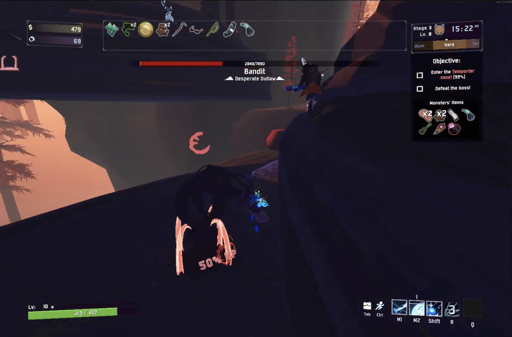

<h1 align="center">Counterboss</h1>

<p align="center">
  
</p>

The Counterboss feature replaces teleporter bosses with an LLM-designed adversary survivor. Each stage, the LLM analyzes your current build and generates a counter-loadout — choosing both a survivor and items specifically intended to beat your win condition. That adversary spawns when the teleporter starts charging and fights you using RoR2's native AI. Its item loadout is displayed in a UI panel (similar to the Void Fields cell display) and the LLM's reasoning for the counter-build appears in chat.

On Commencement, the adversary replaces phase 1 of Mithrix.

Counterboss is independent of the LLM Player Character feature. Common setups:
- **Solo + Counterboss only** — play yourself, LLM designs the boss
- **Co-op + Counterboss** — play with a friend, LLM designs the boss
- **LLM vs. LLM** — LLM controls your character and the adversary simultaneously

---

## Setup

### 1. Enable in mod config

Counterboss is enabled by default. Config is generated at `BepInEx/config/justindwang.rainflayer.cfg` on first run:

```ini
[Counterboss]
EnableCounterboss = true
```

See the [Configuration](#configuration) section below for all options.

### 2. API key

Add your Novita.ai API key to a `.env` file in the repo root:

```
NOVITA_API_KEY=your_key_here
```

If you want to use a different model for counterboss than the player brain (or a different provider entirely), you can override it independently:

```
# Optional — falls back to BRAIN_MODEL / BRAIN_API_KEY if not set
COUNTERBOSS_MODEL=openai/gpt-4o-mini
COUNTERBOSS_API_KEY=sk-...
```

Models are specified in [LiteLLM format](https://docs.litellm.ai/docs/providers): `provider/model-name`.

### 3. Run

Start the brain before or after launching RoR2:

```bash
source venv/bin/activate
python -m brain.main
```

If you only want Counterboss without LLM player control, set `EnableAIControl = false` in the `[Rainflayer]` config section. The brain still needs to be running for the LLM counter-builds — without it, the adversary spawns with a random build.

---

## How It Works

The Python brain runs a background worker alongside the main decision loop. As you pick up items during a stage, the worker calls the LLM each time your inventory changes. By the time you activate the teleporter, the counter-build is already cached and ready — no delay at spawn time.

At stage start, a pre-emptive call runs immediately so a build exists even if you go straight to the teleporter without picking anything up. On stage 1, when you have no items yet, the adversary gets a random survivor with no items.

If no Python brain is connected, the adversary spawns with a random build drawn from the stage's drop pool. The LLM enhancement is entirely opt-in.

---

## Counter-Build Generation

The LLM receives:
- Your current survivor
- Your full item list with rarity breakdown (white / green / red counts)
- A random subset of available items from the run's drop pool (with descriptions)
- A random subset of available survivors (culled by a ban-list of recently used ones)

It returns a survivor choice and an item list designed to counter your specific build, with a short reasoning string that appears in the in-game chat at spawn time.

The total item count and rarity split are matched to yours exactly — the adversary scales with you.

### Survivor variety

A rolling ban-list of the last 4 survivors used prevents the adversary from picking the same survivor repeatedly across stages. The LLM only sees survivors not on the ban-list.

### Build principles

The LLM is prompted with boss-specific item guidance:
- **Good for the adversary:** healing items (large HP pool makes % heals strong), barrier/shield stacking, on-hit procs
- **Bad for the adversary:** on-kill items (useless in a 1v1), boss damage bonus items (they're the boss)

### Fallback

If the LLM returns an invalid response or errors, the adversary gets a random build weighted toward green items.

---

## Configuration

Generated at `BepInEx/config/justindwang.rainflayer.cfg` after first run:

```ini
[Counterboss]
EnableCounterboss = true

# HP multiplier applied on top of the killed teleporter boss's max HP.
# 1.0 = same HP as the boss it replaced.
CounterbossHPMultiplier = 1.0

# Damage multiplier applied to the adversary's base damage.
# 1.0 = full damage, 0.4 = 40%.
CounterbossDamageMultiplier = 0.4

# Multiplier applied to all incoming healing on the adversary.
# 1.0 = full healing, 0.25 = 25%.
CounterbossHealMultiplier = 0.25
```

---

## Technical Details

See [ARCHITECTURE.md](ARCHITECTURE.md) for the full counterboss architecture: the `CounterbossWorker` asyncio task, `CounterbossModel` LLM integration, `CounterbossController` C# spawn flow, and the `COUNTERBOSS_SPAWN` socket message.
